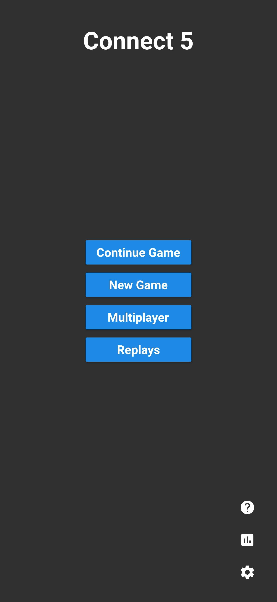
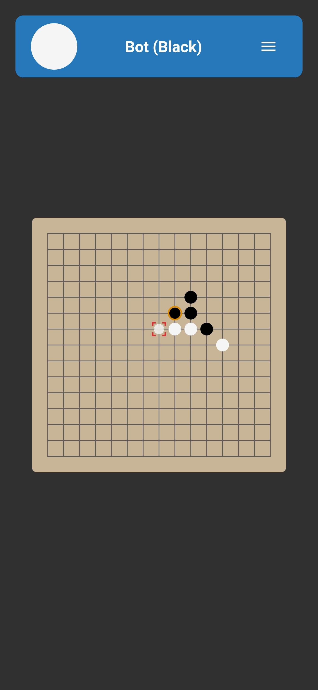
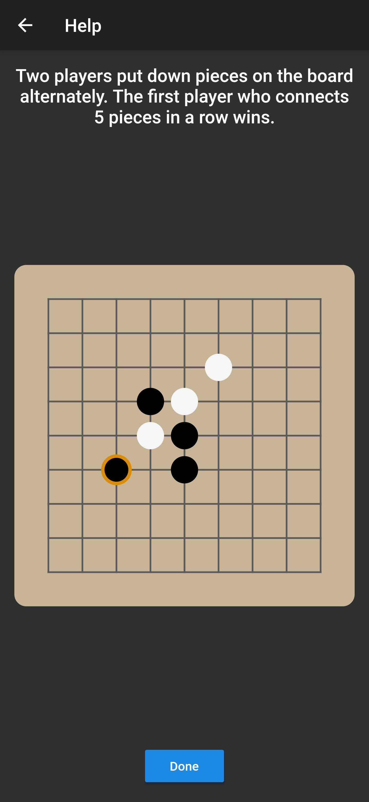
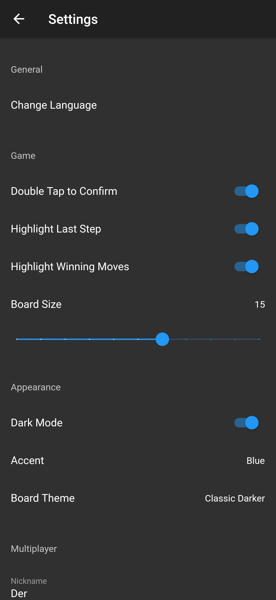
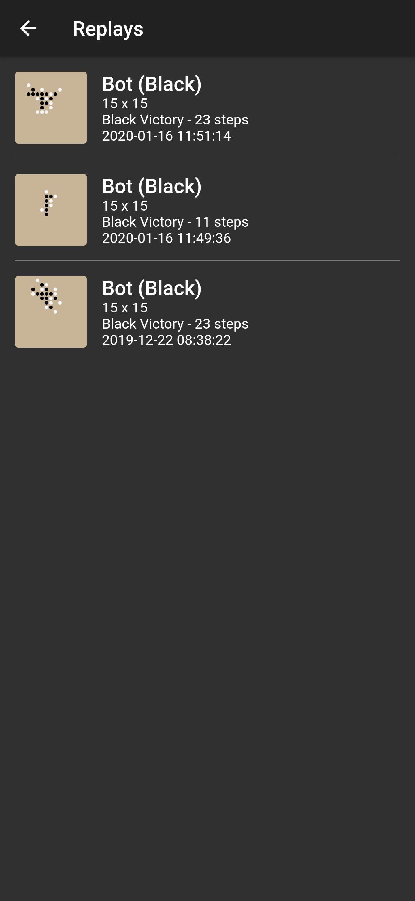

# Connect 5 (Flutter)
The Connect 5 game created using Google's Flutter framework.

[Multiplayer server repository](https://github.com/PeterKeDer/connect-5-server)

## Instructions

First, create a file named `secrets.dart` in the `lib` directory containing:
```dart
String get serverUri => '<link to the server>';
```

When a supported device is connected or an emulator has started, run the app with
```sh
flutter run
```

## Screenshots

#### Menu


#### Gameplay


#### Help


#### Settings


#### Replays

